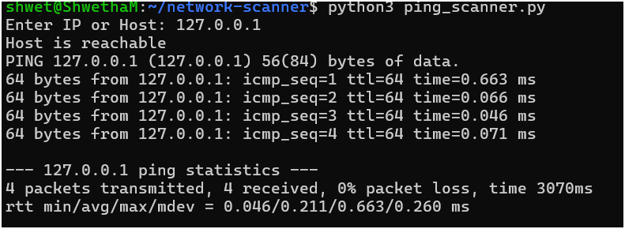
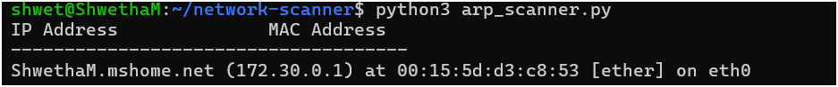
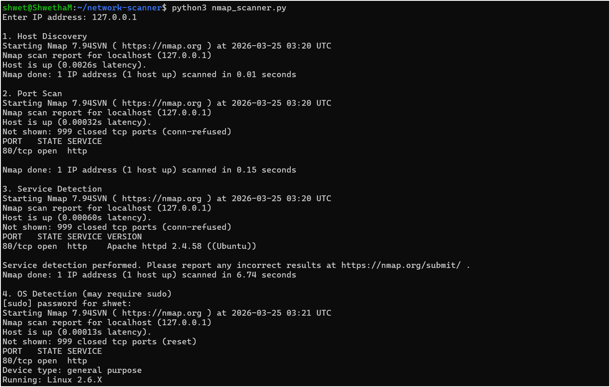

# Network Scanner Project

## Tools Used
- Python
- Nmap

## How to Run

### Ping Scanner
python3 ping_scanner.py

### ARP Scanner
python3 arp_scanner.py

### Nmap Scanner
python3 nmap_scanner.py

## Outputs

### Ping Output

### ARP Output

### Nmap Output

